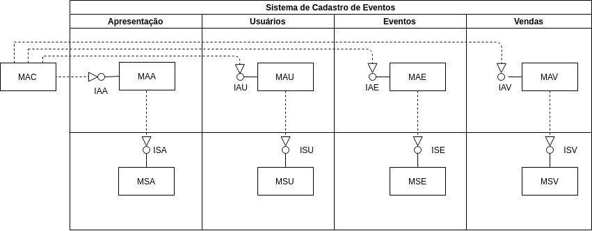
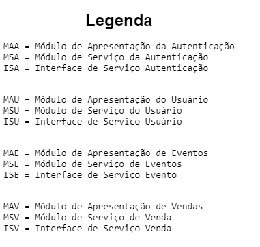

# Arquitetura do Sistema de Cadastro de Eventos

## Pedro Augusto Ramalho Duarte - 17/0163717
## Waliff Cordeiro Bandeira - 17/0115810





## Interfaces

Para a especificação das interfaces foram utilizados trechos da especificação para melhor apresentar e explicar as
funcionalidades das interfaces. Para as funcionalidades que é necessário que o usuário esteja logado ou e que verifique
que o mesmo pode utilizar a funcionalidade é passado via parâmetro o objeto CPF que funciona como chave primária do usuário

## Apresentação de Autenticação

Formulário para login

```
bool autenticar(CPF&) Erro
```
## Apresentação de Usuário

Mostrar informações do usuário

```
Void executar(CPF) Erro
```

Formulário para cadastro

```
void executar() Erro
```
## Apresentação de Eventos

Um usuário que fez ou não login pode ver os eventos
```
void executar() Erro
void executar(CPF) Erro
```

## Apresentação de Vendas

Lista as compras já feitas pelo o usuário


```
bool executar(CPF) Erro
```
O responsável por um evento pode solicitar informação sobre vendas do evento. Nesse caso, o sistema lista, para cada
apresentação do evento, a quantidade total de ingressos vendidos e o CPF de cada comprador de ingresso

```
void vendasDoEvento(CodigoDeEvento) Erro
```

## Serviço de Usuário

Para se cadastrar, precisa informar CPF, senha e os seguintes dados sobre o seu cartão de crédito: número, código
de segurança e data de validade.

```
bool cadastrar(Usuario, CartaoDeCredito) Erro
bool excluir(CPF) Erro
```
## Serviço de Autenticação

Verificar no banco de dados se a senha confere

```
bool autenticar(CPF, Senha) Erro
```
## Serviço de Eventos

Uma vez autenticado, o usuário também tem acesso aos seguintes
serviços providos pelo sistema: cadastrar, descadastrar e alterar
evento.

```
bool criarEvento(CPF, Evento, listaDeApresentacao) Erro
bool alterarEvento(CPF, Evento) Erro
bool descadastrarEvento(CPF, Evento) Erro
```
Qualquer usuário do sistema pode obter dados sobre os eventos programados. Para acessar esses dados, o usuário deve prover os
seguintes dados quando de uma consulta: datas de início e término de período, nome da cidade e sigla do estado no qual
ocorrerá o evento.

```
bool pesquisarEvento(Evento&,DataInicio, DataFim, Cidade, Estado) Erro
```

## Serviço de Vendas

Para adquirir ingressos, o usuário deve informar o código da
apresentação e a quantidade de ingressos desejada.

```
bool adquirirIngresso(CPF, CodigoDeApresentacao, quantidade) Erro
```


